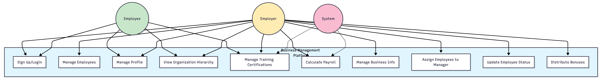
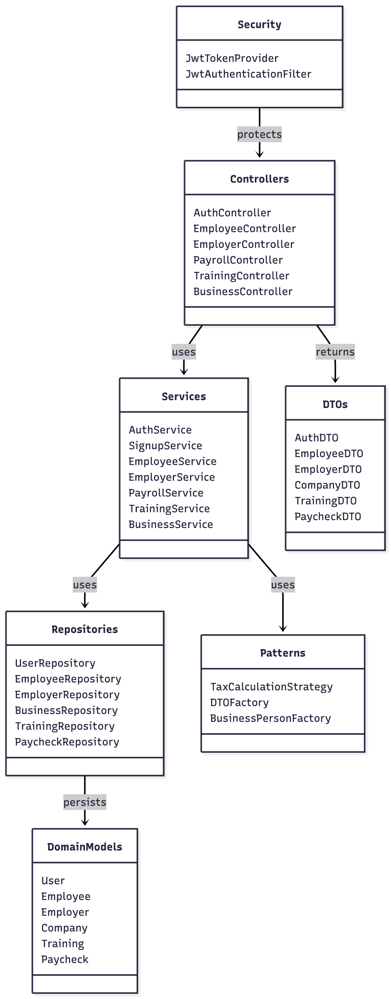
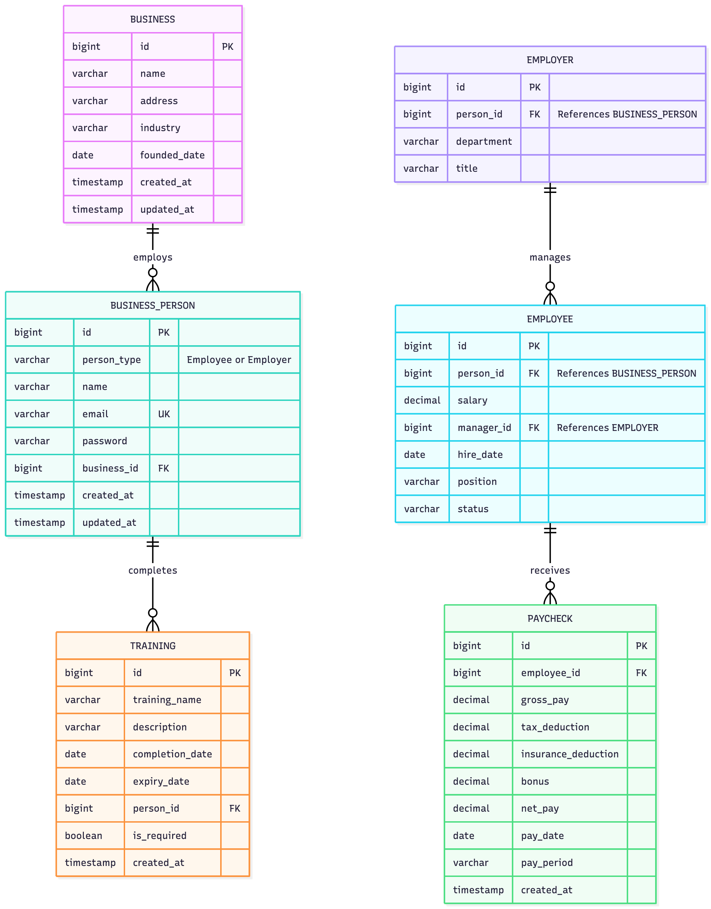
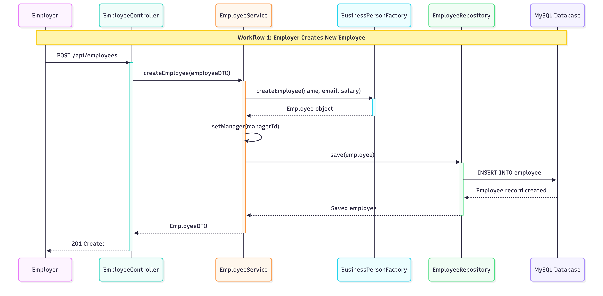
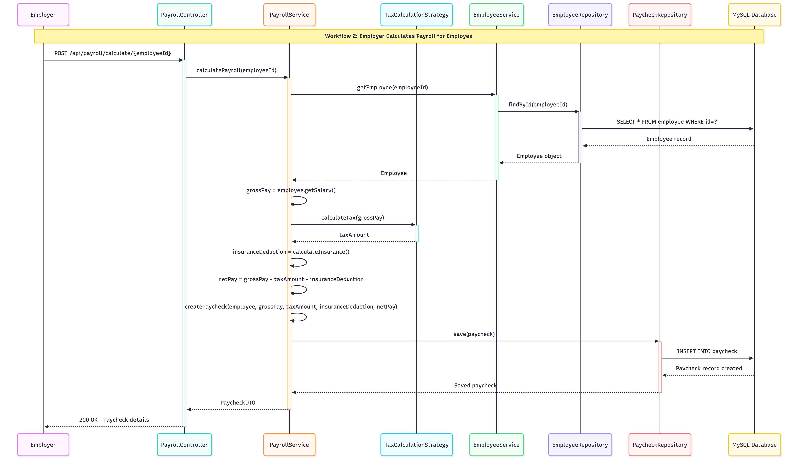

# UML Diagrams - Business Management Platform

## How to run the program

## Configure your MySQL username and password

### Go to the main/resources/ page and do the following
- Create a .env file
- Create a DB_USERNAME and DB_PASSWORD configurations
- Continue with the next steps
- Note: if your username and password are allowed to be root and (no password) then you do not need an environment file


### Start the backend server from the command line
```bash
./mvnw spring-boot:run
```

### If you DO NOT want to do that, just press start on BusinessManagmentApplication class

### Start the the frontend server
```bash
cd src/frontend/src
```

```bash
npm run dev
```

## Use Case Diagram


## Class Diagram


## Condensed Diagram


## ER Diagram


## Sequence Diagrams

### Workflow 1: Create Employee


### Workflow 2: Calculate Payroll


### Workflow 3: Add Training
