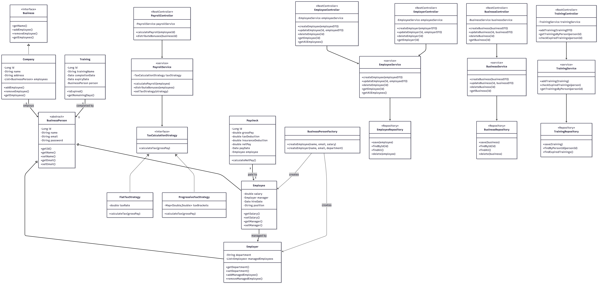
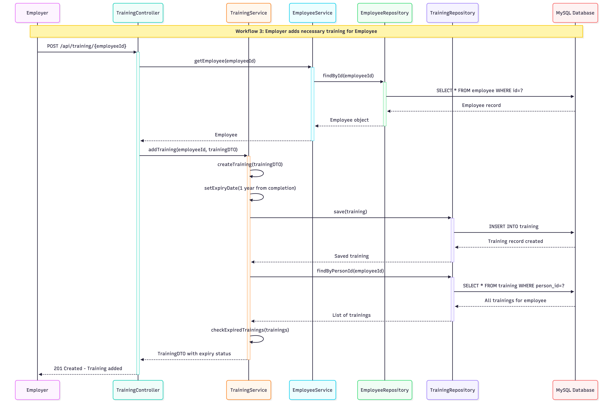

# UML Diagrams - Business Management Platform

## Use Case Diagram

## Class Diagram

## ER Diagram

## Sequence Diagrams

### Workflow 1: Create Employee

### Workflow 2: Calculate Payroll

### Workflow 3: Add Training
